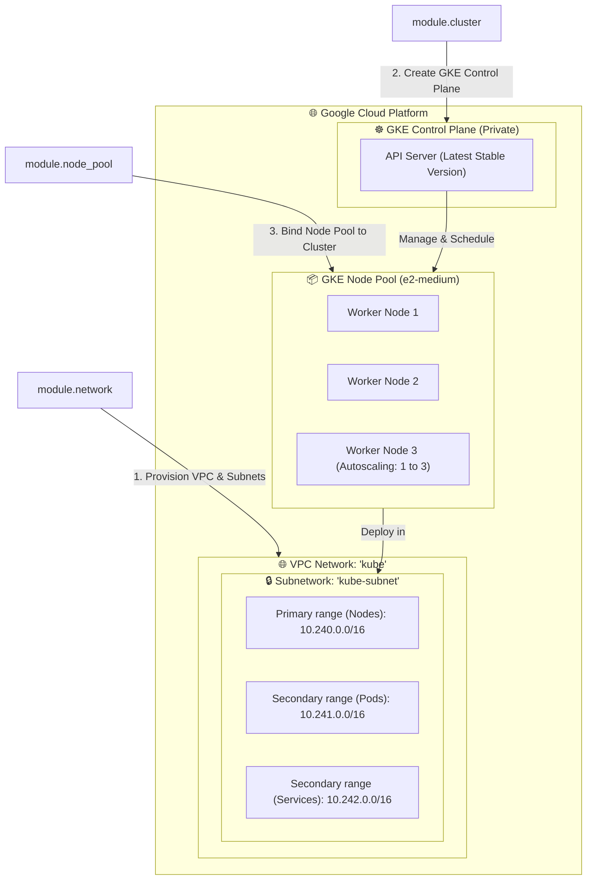

# GKE Cluster Infrastructure Deployment


This repository contains the root Terraform configuration to deploy a private, highly-scalable, and secure **Google Kubernetes Engine (GKE)** cluster in GCP using infrastructure submodules from `module-tf-gcp-vpc`.

---

## 📐 GKE Architecture & Network Topology

The diagram below shows the infrastructure topology and GKE node pool configuration deployed by this project:



---

## 📂 Repository Structure

* **[cluster.tf](file://cluster.tf)**: Composes submodules to build the network, private cluster control plane, and autoscaling GKE Node Pool. It dynamically queries the Google API to retrieve the latest stable Kubernetes version.
* **[provider.tf](file://provider.tf)**: Google provider setup. Reads target project and region dynamically.
* **[variables.tf](file://variables.tf)**: Defines configurations variables (e.g. region).
* **[versions.tf](file://versions.tf)**: Enforces required Terraform version (`>= 1.0`) and Google Cloud provider (`>= 4.0.0`).

---

## 🚀 How to Run & Deploy

### 1. Setup GCP Authentication
Instead of hardcoding service account JSON keys (anti-pattern), authenticate using Google Application Default Credentials (ADC):
```sh
gcloud auth application-default login
```
Set your current GCP project:
```sh
gcloud config set project YOUR_PROJECT_ID
```

### 2. Configure project variables
Create a `terraform.tfvars` file (do not commit it!) or pass variables inline:
```sh
# Modify project inside provider.tf or use env variables
export TF_VAR_region_common="us-central1"
```

### 3. Initialize and Deploy
Initialize Terraform:
```sh
terraform init
```
Generate and review deployment plan:
```sh
terraform plan
```
Apply and provision the EKS cluster:
```sh
terraform apply
```

### 4. Connect to GKE Cluster
Once the cluster is successfully provisioned, configure local `kubectl` access:
```sh
gcloud container clusters get-credentials gke-cluster --region us-central1 --project YOUR_PROJECT_ID
```
Verify the GKE nodes are ready:
```sh
kubectl get nodes
```

---

## 🛡️ CI/CD Validation
This repository has an active GitHub Actions workflow configured in `.github/workflows/validate.yml`. Upon every pull request or push to the `master` branch, it automatically initializes and validates the configuration of all GCP submodules using Terraform version `1.5.7` to ensure syntax compliance.
